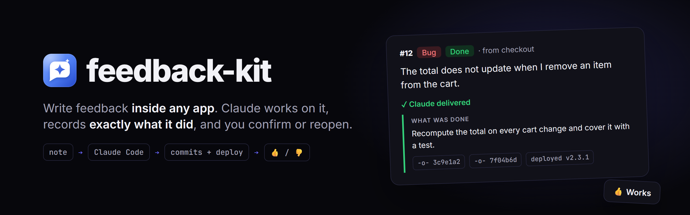
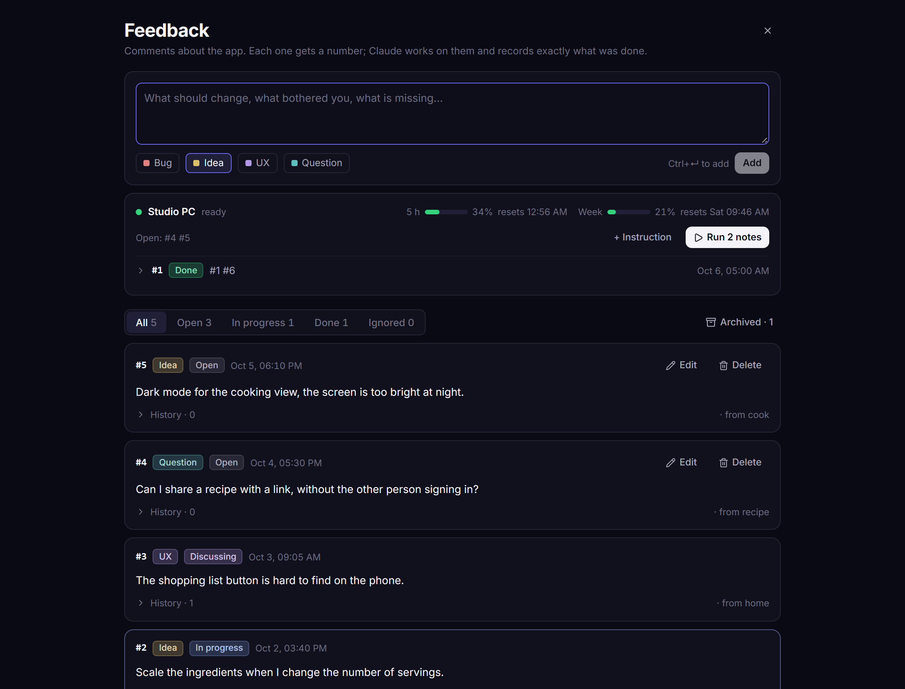
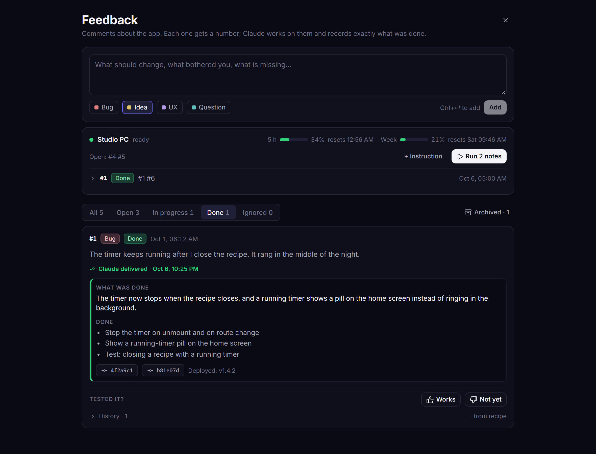
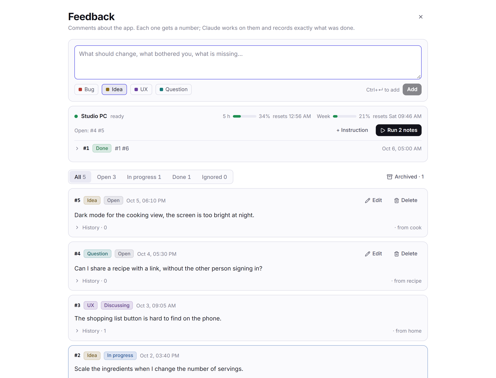
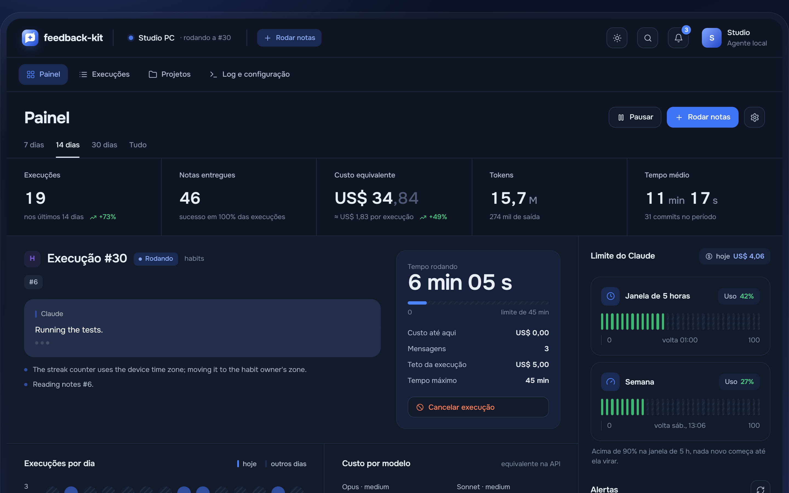
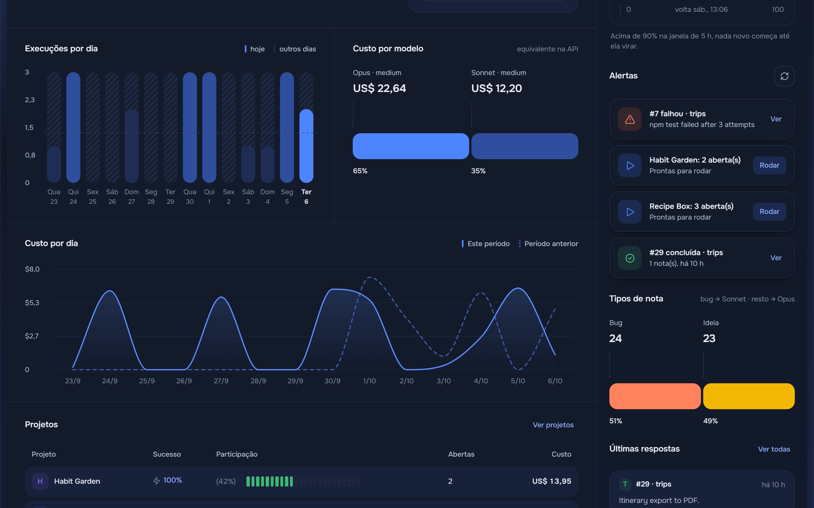
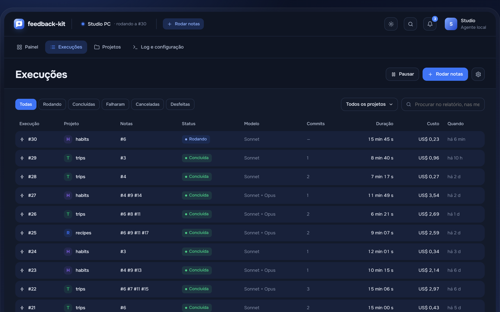
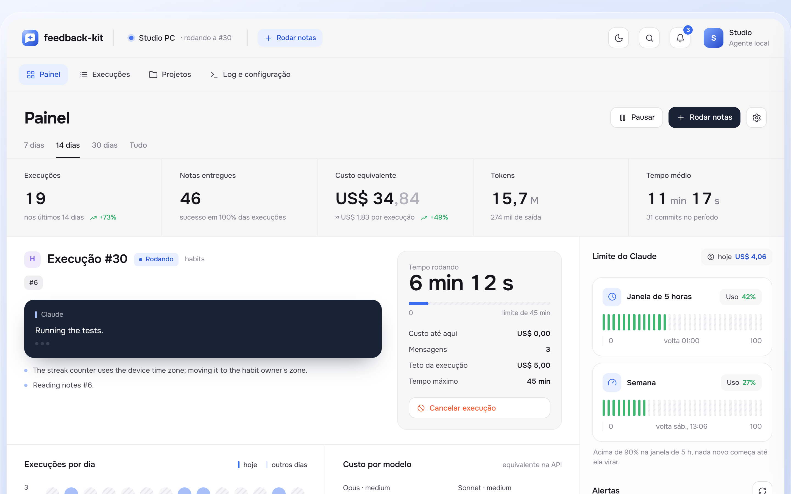

<div align="center">

<picture>
  <source media="(prefers-color-scheme: dark)" srcset=".github/assets/banner-dark.png">
  <source media="(prefers-color-scheme: light)" srcset=".github/assets/banner-light.png">
  
</picture>

<br>


<br><br>

**One feedback queue for all your apps.** You write notes inside each app, Claude works on
them and records exactly what it did, and you confirm with 👍 or reopen with 👎.

[Pieces](#pieces) · [Use it in an app](#use-it-in-an-app) · [Theming](#theming) · [Run from your phone](#run-it-on-your-computer-from-your-phone) · [Dashboard](#the-computer-dashboard) · [Deploy](#deploy-your-own)

</div>

<br>

<table>
  <tr>
    <td width="50%"></td>
    <td width="50%"></td>
  </tr>
  <tr>
    <td align="center"><b>The queue</b> · bugs, ideas, UX and questions, numbered per app</td>
    <td align="center"><b>Delivered</b> · what was done, commits, version, and your 👍/👎</td>
  </tr>
</table>

<details>
<summary><b>Light theme</b></summary>
<br>

</details>

<sub>Screenshots use a fictional "Recipe Box" app on a local Worker with a throwaway database.</sub>

## Why

Every app I build ended up with its own "notes" screen, and they kept drifting apart. The
kit replaces them with one Worker, one database and one Web Component, and turns the
notes into a work queue that Claude Code can pick up, resolve and report on.

## Pieces

Four pieces, each updated in one place only:

| Piece                                     | What it is                                                     | How it reaches the apps                                                                  |
| ----------------------------------------- | -------------------------------------------------------------- | ---------------------------------------------------------------------------------------- |
| **Worker + D1** (`worker/`, `migrations/`) | The API and the database, shared by every app                   | `npm run deploy`                                                                         |
| **Widget** (`widget/`)                    | `<feedback-panel>`, a Web Component (Preact, shadow DOM)       | Apps load `/v1/widget.js` from the Worker, so a deploy reaches all of them, no rebuild   |
| **Skill + CLI** (`skill/`, `cli/`)        | The queue rules and Claude's tool                               | `git pull` here; the installed skill only points to this repository                     |
| **Agent** (`agent/`)                      | Runs on your computer and executes in Claude Code what the panel asks | `git pull` here; the tray icon restarts it                                         |

## Use it in an app

```html
<script type="module" src="https://<your-worker>.workers.dev/v1/widget.js"></script>
<feedback-panel app="recipes" screen="home" lang="en" closable></feedback-panel>
```

| Attribute  | Meaning                                                                                    |
| ---------- | ------------------------------------------------------------------------------------------ |
| `app`      | The app id in the kit (required)                                                           |
| `screen`   | Where the panel was opened from; saved with each note (never a file path)                  |
| `lang`     | `pt` or `en` (default: the browser's)                                                      |
| `theme`    | `light` or `dark` (default: the system's). Hosts that map their own tokens can omit it     |
| `closable` | Shows the X and closes on Esc; the app listens to `feedback-close`                         |
| `api`      | Another Worker (local development); by default, the one the script came from               |

| Property     | Meaning                                                                                     |
| ------------ | ------------------------------------------------------------------------------------------- |
| `appContext` | An object, or a function returning one: the app state (version, stage, sync...), saved in `context.app` |
| `accessCode` | A code the app already holds, so the person is never asked for one                          |

| Event            | Meaning                                                                                       |
| ---------------- | --------------------------------------------------------------------------------------------- |
| `feedback-close` | The person closed the panel                                                                    |
| `feedback-link`  | `detail.url`, cancelable: `preventDefault()` to open the link yourself (Tauri sends it to the system browser) |

<details>
<summary><b>React</b></summary>

```tsx
useEffect(() => {
  void import(/* @vite-ignore */ 'https://<your-worker>.workers.dev/v1/widget.js')
}, [])

<feedback-panel ref={ref} app="recipes" closable />
// ref.current.appContext = () => ({ version, stage })
// ref.current.addEventListener('feedback-close', onClose)
```

The element type for TSX:
`declare module 'react' { namespace JSX { interface IntrinsicElements { 'feedback-panel': any } } }`.

</details>

## Theming

The panel draws inside a shadow DOM: the app's CSS does not leak in and the panel's does
not leak out. Its look is adjusted through **tokens**, CSS variables that cross that
boundary. Every token has a light and a dark default, and the app maps its own on top:

```css
feedback-panel {
  --fb-bg: var(--bg-content);
  --fb-surface: var(--surface-1);
  --fb-border: var(--border-default);
  --fb-text: var(--text-primary);
  --fb-focus: var(--accent);
  --fb-radius-lg: var(--radius-lg);
  --fb-font: var(--font-ui);
}
```

<details>
<summary><b>All tokens and parts</b></summary>

<br>

Tokens: `--fb-bg`, `--fb-surface`, `--fb-surface-hover`, `--fb-surface-active`,
`--fb-input`, `--fb-border`, `--fb-border-subtle`, `--fb-border-strong`, `--fb-text`,
`--fb-text-secondary`, `--fb-text-muted`, `--fb-focus`, `--fb-primary-bg`,
`--fb-primary-text`, `--fb-danger`, `--fb-positive`, `--fb-warning`, `--fb-claude`, the
tones `--fb-blue`, `--fb-purple`, `--fb-cyan`, `--fb-yellow`, `--fb-red`, `--fb-teal`,
`--fb-gray`, `--fb-radius-sm|md|lg`, `--fb-font`, `--fb-font-mono`, `--fb-font-size`,
`--fb-max-width` and `--fb-padding`.

For fine tuning, the parts: `page`, `card`, `note`, `composer`, `resolution`, `pill`,
`chip`, `input`, `button`, `button-primary`, `filters`
(`feedback-panel::part(card) { … }`).

</details>

> [!IMPORTANT]
> **`/v1/` is the contract.** Renaming or changing the meaning of a token, attribute,
> event or part breaks apps: that goes to `/v2/widget.js`, and v1 stays as it was.

## The queue, from Claude

```bash
npm run install-skill        # once per machine: the Claude Code skill
node cli/feedback.mjs apps   # registered apps
```

Reading, updating and delivering notes is described in [skill/SKILL.md](skill/SKILL.md).
A note goes through `open → in_progress → done`, or `discussing` when it needs a decision,
and every change is logged with who made it. Claude's delivery is structured: a summary,
what was done, what was ignored, decisions, commits, the deployed version and follow-ups.

## Run it on your computer, from your phone

The panel has a **Run N notes** button. It queues the open notes on the Worker; the agent
on your computer picks them up, runs Claude Code headless in the project folder and
streams everything back to the panel while it works: what Claude is saying, the final
report, the commits, the cost and the tokens. Each run can be **canceled** and, once
finished, **undone** (`git revert` of its commits, push, the project's deploy and the notes
back to open; this runs without Claude and costs nothing).

```
phone ── POST /runs ──▶ Worker (D1: runs, agents) ◀── polls every 20 s ── agent on your computer
  ▲                                                                              │
  └──────── the panel reads progress every 4 s ◀── reports ── claude -p ◀────────┘
```

- **Which Claude.** Bugs go to Sonnet; ideas, UX and questions go to Opus, both at medium
  effort (`models` in the agent config). A run with both kinds runs two sessions in a row,
  bugs first.
- **Idle costs nothing.** The agent's poll is a plain HTTP call to the Worker (about 4,000
  a day, far from the free limit). Claude Code only starts when there is a run.
- **Plan limits.** Claude Code reports the 5-hour and weekly windows on every run; the
  agent stores them and the panel shows them. Above `maxFiveHour` (90%) no new run starts.
- **Nobody around.** The run prompt tells Claude not to ask: an ambiguous note goes to
  `discussing` with the question, and it moves on. The agent only starts on a clean
  working tree, pulls with `--ff-only` first and makes sure to push afterwards.
- **Canceling does not publish.** Commits not pushed yet stay on the computer in a
  `feedback-kit/parada-<id>` branch, loose changes go to `git stash`, and notes in the
  middle go back to open.

<details>
<summary><b>Set it up (once)</b></summary>

<br>

1. On the Worker, the run code (the panel asks for it once per device; it is the same for
   every app):

   ```bash
   node cli/feedback.mjs run-code | npx wrangler secret put RUN_HASH
   npm run deploy      # applies migration 0002 and publishes the new panel
   ```

2. On a Windows computer (Node 22+, Git, Claude Code installed and signed in, and
   `~/.feedback-kit/admin-code.txt`):

   ```powershell
   git clone https://github.com/megomes/feedback-kit $HOME\Code\feedback-kit
   cd $HOME\Code\feedback-kit; npm ci
   powershell -ExecutionPolicy Bypass -File agent\install-windows.ps1
   ```

   It installs the skill, creates `~/.feedback-kit/agent.json`, lists the projects it
   found, adds a Startup shortcut and starts the tray icon.

3. On your phone, in any app's panel: **Run on computer...** and paste the contents of
   `~/.feedback-kit/run-code.txt`.

On macOS or Linux the same agent runs with `npm run agent` (no tray icon; put it in
launchd, systemd or `pm2`).

</details>

<details>
<summary><b>Projects and configuration</b></summary>

<br>

The agent finds projects on its own: every folder with a `feedback-kit.json` inside the
`roots` (up to two levels deep). The deploy command used by undo lives in the same file:

```json
{ "app": "recipes", "deploy": "npm run deploy" }
```

`~/.feedback-kit/agent.json`:

| Key              | Default                                   | Meaning                                                                       |
| ---------------- | ----------------------------------------- | ----------------------------------------------------------------------------- |
| `name`           | the computer's name                       | How it shows up in the panel                                                  |
| `roots`          | `["~/Code"]`                              | Where to look for projects                                                    |
| `projects`       | `{}`                                      | `{ "<app>": "<folder>" }`, by hand, wins over the search                      |
| `models`         | bug: `sonnet`/`medium`; rest: `opus`/`medium` | `--model` and `--effort` per note kind (`bug`, `idea`, `ux`, `question`; `default` for the rest) |
| `maxBudgetUsd`   | `5`                                       | `--max-budget-usd` per run: stops a runaway run                               |
| `timeoutMinutes` | `45`                                      | Stops after this                                                              |
| `permissionMode` | `bypassPermissions`                       | Nobody approves tools; `auto` is more careful and may stop midway             |
| `maxFiveHour`    | `0.9`                                     | No new run when the 5-hour window is above this                               |
| `dashboardPort`  | `47820`                                   | The local dashboard port (127.0.0.1 only)                                     |

</details>

### The computer dashboard

While running, the agent serves a dashboard for that computer only at
`http://127.0.0.1:47820`: the live run (what Claude is saying, the model of each step,
time and cost, and cancel), the plan limits, runs and cost per day, cost per model, note
kinds, projects, alerts, the latest answers and the full history, with each run's details
and undo. It opens in its own window from the Start menu, by double-clicking the tray
icon, or with `node agent/agent.mjs open`, and only accepts requests from its own page.



<table>
  <tr>
    <td width="50%"></td>
    <td width="50%"></td>
  </tr>
  <tr>
    <td align="center"><b>Cost and activity</b> · per day, per model, per note kind</td>
    <td align="center"><b>Every run</b> · filter, search, open details, undo</td>
  </tr>
</table>

<details>
<summary><b>Light theme</b></summary>
<br>

</details>

<sub>The dashboard interface is in Brazilian Portuguese. Screenshots use three fictional apps and made-up runs.</sub>

Each run keeps Claude Code's full output in `~/.feedback-kit/runs/<id>.jsonl`, and the log
is in `~/.feedback-kit/agent.log`.

> [!WARNING]
> **Security.** An app's code can only write notes; running, canceling and undoing also
> require the run code. Still, note text becomes instructions for a Claude with full
> permissions on your computer: only give an app's code to people you would let touch the
> code.

## Access codes

- **Admin:** the CLI sends the code in `~/.feedback-kit/admin-code.txt`; the Worker only
  stores its SHA-256, in the `ADMIN_HASH` secret.
- **Remote runs:** `~/.feedback-kit/run-code.txt`; the Worker stores its SHA-256 in the
  `RUN_HASH` secret (without it, the button does not show up). Rotate it with
  `node cli/feedback.mjs run-code --new | npx wrangler secret put RUN_HASH`.
- **Per app:** `node cli/feedback.mjs apps add <id> "<Name>" [repo]` generates a new code,
  saves it in `~/.feedback-kit/codes/<id>.txt` and stores the hash in the database. It is
  pasted once on each device, in the panel itself (or the app passes it in `accessCode`).

<details>
<summary><b>Rotate the admin code</b></summary>

```bash
node -e 'process.stdout.write(require("crypto").randomBytes(32).toString("base64url"))' > ~/.feedback-kit/admin-code.txt
node -e 'process.stdout.write(require("crypto").createHash("sha256").update(require("fs").readFileSync(process.argv[1],"utf8")).digest("hex"))' ~/.feedback-kit/admin-code.txt | npx wrangler secret put ADMIN_HASH
```

</details>

## Develop

```bash
npm run verify    # types, Worker tests (the real migration on Node's SQLite) and build
npm run dev       # local Worker at http://localhost:8787 with a local D1
```

Locally: `.dev.vars` with `ADMIN_HASH=<sha-256>` (git-ignored) and
`npx wrangler d1 migrations apply feedback-kit --local`. Point the CLI at it with
`FEEDBACK_KIT_URL=http://localhost:8787 FEEDBACK_KIT_ADMIN_CODE=<code>`, and the panel with
the `api` attribute. The Worker's root serves a demo page: `?app=<id>&theme=dark&lang=en`.

> [!TIP]
> In D1 triggers, write `BEGIN` and `END` in uppercase. Remote D1 does not recognize a
> trigger body written in lowercase.

## Deploy your own

1. Create the database with `npx wrangler d1 create feedback-kit` and put its id in
   `wrangler.jsonc`.
2. Set the admin hash: see [Rotate the admin code](#access-codes).
3. Publish:

```bash
npm run deploy
```

It builds the widget, applies pending migrations and publishes the Worker. Bump `version`
in `package.json` on every widget change: it goes into `context.kit.version` of each note.

<br>

<div align="center">
<sub>Built by <a href="https://github.com/megomes">Matheus Ervilha</a> to keep side projects moving with Claude Code.</sub>
</div>
